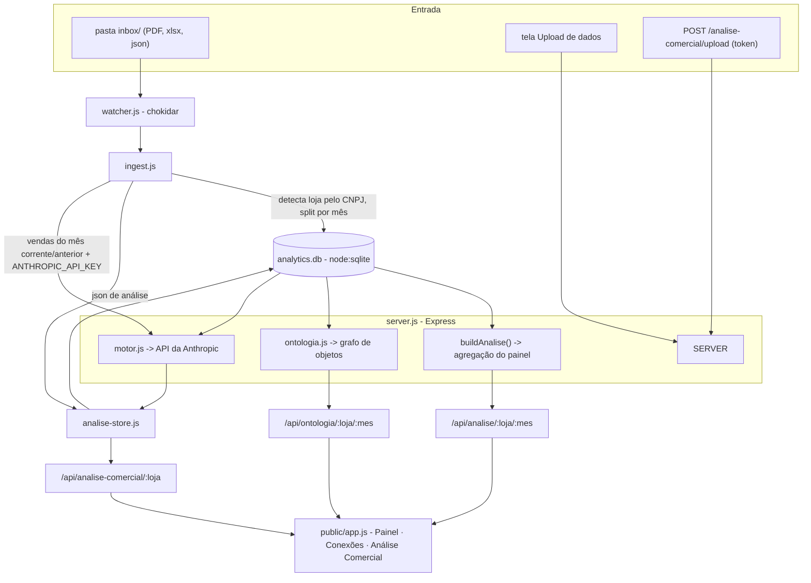

# Analytics — Documentação do Sistema

Referência completa do sistema **Analytics** (Minas Farma · Farma e Farma, Baixo Guandu/ES).
Para começar rápido, veja o `README.md`. Este arquivo detalha arquitetura, módulos, dados,
rotas, configuração e fluxos.

- **Diretório:** `C:\Sistema Marketing`
- **Repositório:** https://github.com/thgustavo62-design/Analytics
- **Stack:** Node.js (≥ 22) · Express · `node:sqlite` · sem framework de frontend, sem build
- **Independente** do `app_minasfarma/` — não lê nem escreve nada lá dentro

---

## 1. O que é

Um site local **autoalimentável** que transforma os documentos brutos do mês (relatório de
vendas em PDF, planilha de concorrentes, métricas de Instagram) em:

1. **Painel** — vendas + redes sociais + concorrência, com o mês corrente "ao vivo" e
   histórico por loja/mês.
2. **Análise Comercial** — diagnóstico profundo mensal (diagnóstico executivo, decisão
   principal, scorecard de campanhas, riscos, plano de ação), gerada pela API da Anthropic
   a partir de agregados calculados no próprio sistema.
3. **Conexões** — mapa de objetos interligados (estilo Palantir): categorias, campanhas,
   canais, concorrentes, sinais e os achados da Análise Comercial, todos ligados pelo que
   cada um toca.

Você joga arquivos numa pasta (`inbox/`) e o site percebe sozinho. Roda como servidor
sempre ligado nesta máquina; o navegador acessa `http://localhost:4180`.

---

## 2. Rodar e manter no ar

```bash
npm install
npm start            # http://localhost:4180 — senha 1234
```

Ou **duplo-clique em `iniciar.bat`**. Depois é só salvar arquivos em
`C:\Sistema Marketing\inbox` (veja `inbox/LEIA-ME.txt`).

### Sempre ligado
- **`iniciar.bat`** numa janela aberta (mais simples).
- **Tarefa Agendada do Windows** no logon → programa `node`, argumento `server.js`,
  "Iniciar em" `C:\Sistema Marketing`.
- **Serviço do Windows** com [nssm](https://nssm.cc): `nssm install Analytics`.

### Variáveis de ambiente

| Var | Default | Uso |
|---|---|---|
| `PORT` | `4180` | porta HTTP |
| `APP_PASSWORD` | `1234` | senha única (login) |
| `SESSION_SECRET` | aleatória por boot | assina o cookie de sessão; defina p/ sessão sobreviver a restart |
| `VA_DB_PATH` | `data/analytics.db` | caminho do SQLite |
| `VA_INBOX` | `./inbox` | pasta observada |
| `VA_POLL_MIN` | `5` | minutos entre recargas automáticas do mês corrente no navegador |
| `VA_ANALISES` | `data/analises` | espelho em disco dos JSONs de Análise Comercial |
| `ANALISE_UPLOAD_TOKEN` | — | se definido, exige header `X-Analise-Token` no `POST /analise-comercial/upload` |
| `ANTHROPIC_API_KEY` | — | se definido, o site **gera a Análise Comercial sozinho** (botão + auto + verificação diária) |
| `ANTHROPIC_AUTH_TOKEN` | — | alternativa à API key (perfil OAuth) |
| `ANALISE_MODEL` | `claude-opus-5` | modelo da geração (ex.: `claude-sonnet-5` p/ gastar menos) |
| `AUTO_ANALISE` | ligado se há chave | `0` desliga a geração automática (mantém o botão manual) |
| `VA_NO_AUTH` | — | `1` desliga a autenticação — **só teste local** |

`GET /healthz` responde sem login.

---

## 3. Arquitetura



### Pipeline de agregação (Painel)
`vendas_transacoes` → `aggregate.js` (KPIs, série diária, dia da semana, categorias, top
produtos) + `insights.js` (regras automáticas) + `getConcorrencia` + `config/lojas.json`
→ `buildAnalise()` monta a resposta que `app.js` desenha.

### Pipeline de análise profunda (Análise Comercial)
`vendas_transacoes` (+ concorrência + calendário de campanhas) → `analytics-deep.js`
(`analiseProfunda`: ticket médio/mediano, baseline semanal com desvio, Pareto,
incrementalidade intradiária por campanha, canais convênio/delivery/balcão, concentração
cliente/convênio, operadores, resumo de concorrentes) → `motor.js` monta o *system prompt*
(`prompts/motor-analise-comercial.md`) + manda **só os agregados** → o modelo interpreta e
devolve o JSON do contrato → `validate-analise.js` (1 retry) → `analise-store.js` grava no
banco (tabela `analises_comerciais`) e num espelho `.json`.

### Pipeline do grafo (Conexões)
`analiseProfunda` + `getConcorrencia` + `config/lojas.json` + (se houver) a Análise
Comercial → `ontologia.js` (`construirOntologia`) → nós + arestas com significado →
`app.js` desenha um grafo SVG radial.

---

## 4. Módulos

| Arquivo | Responsabilidade |
|---|---|
| `server.js` | Rotas HTTP, auth por senha única, estáticos, `buildAnalise()`, exports `.html`, verificação diária da Análise Comercial. |
| `db.js` | Acesso ao SQLite (`node:sqlite`). Cria/migra o schema, faz seed das lojas. **Toda consulta passa por `periodo_id`** (uma loja só). Helpers: `getOrCreatePeriodo`, `replaceVendas`/`setVendasMeta`/`getVendas`, `getFaturamento`, `getDiasComVenda`, `replaceInstagram`/`getInstagram`, `replaceConcorrencia`/`getConcorrencia`, `saveAnaliseComercial`/`getAnaliseComercial`/`listAnalisesComerciais`, `listPeriodos`. |
| `schema.sql` | Definição das tabelas. |
| `watcher.js` | Observa `inbox/` (`chokidar`), serializa a ingestão (parser de PDF é pesado), mantém `data/inbox-log.json`, dispara `maybeAutoAnalise` após ingest de vendas. |
| `ingest.js` | Recebe **1 arquivo** e roteia: PDF → `ingestVendas` (detecta loja pelo CNPJ do cabeçalho via `resolveLoja`, split por mês, valida a soma, grava); xlsx `Concorrentes_Coleta_*` → `ingestConcorrentes` (aplica às 2 lojas); `*.json` com `meta`+`diagnostico_executivo` → `ingestAnaliseComercial`; `*instagram*.json` → `ingestInstagramJson`. |
| `parsers/vendas.js` | PDF "Analítico de Vendas" via `pdfjs-dist`. Regex ancorada nos tokens fortes; tolera `Nº Cx` ausente e valores negativos (ARREDONDAMENTO). Extrai razão social + CNPJ do cabeçalho, timestamp `Pag.: 1/N`, período declarado, e detecta **dia parcial**. **Lança** se `Σ vl != "Total:"`. |
| `parsers/concorrentes.js` | Lê a 1ª aba do xlsx (36 colunas). Mantém só `Status validação = Confirmada` e não expirada. Casa `Produto`+`Marca` com o que a loja vendeu (`match.js`), compara `Preço promo` com o nosso preço médio. **Marca é filtro duro.** |
| `parsers/instagram.js` | Normaliza o formulário / JSON manual (6 métricas: valor de exibição + variação %). Sem OCR. |
| `match.js` | Casamento de nome de produto por sobreposição de tokens (Jaccard) + `brand` como filtro duro. Portado de `app_minasfarma/match.js`. |
| `classify.js` | Classificador de categoria por palavra-chave, lê `config/categorias.json` (recarrega ao editar). |
| `aggregate.js` | `vendas_transacoes` → KPIs, série diária (dia parcial marcado e fora da tendência), dia da semana, categorias, top 15 produtos, preço médio por produto. |
| `insights.js` | Regras automáticas → cards: (1) dia de pico ≥ +50% da média; (2) **cada campanha** vs. resto da semana; (3) "Diversos" > 5%; (4) conta única (convênio/cliente) > 5% do faturamento. Limiares em `config/insights.json`. |
| `analytics-deep.js` | `analiseProfunda` — agregados dos Passos 1–8 do prompt (ver seção 3). Determinístico. Usa `emp_id`/`cli_id`. |
| `motor.js` | `gerarAnalise` (chama a API da Anthropic: `claude-opus-5`, `thinking: adaptive`, `effort: high`, `max_tokens 16000`; extrai + valida com 1 retry; normaliza `meta`; grava). `podeGerar` (há chave?). `maybeAutoAnalise` (regen automática do mês corrente/anterior se não há análise < 20 dias). |
| `validate-analise.js` | Validador (sem dependência) do contrato da Parte 2. Números aceitam `null`; duro em `meta`/`diagnostico_executivo`/`pergunta_central`, listas e itens. |
| `analise-store.js` | Fonte de verdade = **banco**. `save` grava na tabela + espelho `.json`; `read` lê do banco (migra arquivo→banco se preciso); `saveErro` grava `*.INVALIDO.json`. |
| `ontologia.js` | `construirOntologia` — grafo de nós (loja, categoria, canal, campanha, concorrente, sinal, risco, oportunidade, ação, decisão, veredito) + arestas (`vende`, `canal`, `promove`, `pressiona`, `afeta`, `causa`, `sobre`, …) + cruzamentos ("Campanha sob pressão em X", "Conta de convênio concentrada", "Concentração de SKUs"). |
| `public/index.html` | App shell (top bar, sidebar, `#view`). |
| `public/app.js` | Todo o frontend: carrega lojas/períodos, roteia as views por hash, desenha gráficos SVG à mão, o grafo de Conexões, a Análise Comercial. |
| `public/styles.css` | Estilos (app shell + gráficos + grafo + Análise Comercial). |
| `public/upload.html` | Redireciona para `/#upload`. |

---

## 5. Modelo de dados (`data/analytics.db`)

Toda agregação filtra por `periodo_id` — nunca soma Minas Farma com Farma e Farma.

| Tabela | Campos principais |
|---|---|
| `lojas` | `id`, `nome` (`Minas Farma` \| `Farma e Farma`) |
| `periodos` | `id`, `loja_id`, `ano`, `mes`, `criado_em`, `atualizado_em`, `vendas_ultimo_dia`, `vendas_ultimo_dia_parcial`, `vendas_ultimo_dia_motivo`, `vendas_total_impresso`, `vendas_fonte_gerada_em`. `UNIQUE(loja_id, ano, mes)` |
| `vendas_transacoes` | uma linha por item vendido: `periodo_id`, `data`, `hora`, `lancamento` (nº da venda), `barras`, `descricao`, `categoria` (do classificador), `preco_unit`, `quantidade`, `valor_liquido`, `forma_pagto` (`A VISTA`\|`A PRAZO`), `emp_id` (convênio), `cli_id` (cliente) |
| `instagram_metricas` | `periodo_id`, `metrica`, `rotulo`, `valor_exibicao` (`"414,3 mil"`), `delta_pct`, `observacao`, `ordem` |
| `concorrencia_ofertas` | `periodo_id`, `concorrente`, `categoria`, `produto`, `preco_normal`, `preco_promo`, `validade`, `nivel_confianca`, `status_validacao`, `nosso_preco_medio`, `abaixo_do_nosso` (1/0/null) |
| `analises_comerciais` | `loja_id`, `ano`, `mes`, `gerado_em`, `json` (documento inteiro), `criado_em`, `atualizado_em`. `UNIQUE(loja_id, ano, mes)` |

Gitignored (dados / não versionados): `data/analytics.db*`, `data/uploads/`, `data/analises/`,
`data/inbox-log.json`, `inbox/*` (exceto `LEIA-ME.txt`), `node_modules/`, `.env`, `*.log`.

---

## 6. Configuração

### `config/lojas.json`
Por loja: `endereco`, `instagram`, `cnpj` (roteia o PDF), `razaoSocial`, `horaFechamento`
(marca dia parcial), `concorrentes[]` (cards do radar), e **`campanhas[]`**:

```json
"campanhas": [
  { "nome": "Fralda e Leite (segunda e terça)", "dias": [1, 2], "categorias": ["Fraldas", "Leite Infantil"] },
  { "nome": "Limpeza (sexta a domingo)",        "dias": [5, 6, 0], "categorias": ["Limpeza"] }
]
```

`dias` na convenção JS `getDay()`: 0=domingo … 6=sábado. `categorias` aponta para categorias
do classificador. A análise avalia **cada campanha** pelo método intradiário (participação
da(s) categoria(s) no faturamento do próprio dia, campanha vs. 2 baselines).

Calendário atual:

| Loja | Campanha | Dias | Categorias |
|---|---|---|---|
| Minas Farma | Fralda e Leite | seg e ter | Fraldas, Leite Infantil |
| Minas Farma | Limpeza | sex a dom | Limpeza |
| Farma e Farma | Fralda e Leite | qua e qui | Fraldas, Leite Infantil |
| Farma e Farma | Limpeza | sex a dom | Limpeza |

### `config/categorias.json`
Regras de palavra-chave, avaliadas de cima para baixo (`igual` / `contem` / `exceto`).
Ordem atual: Taxa de Entrega → Diversos → Fraldas → Leite Infantil → Suplementos →
**Limpeza** → Perfumaria/Higiene → *(fallback)* Medicamentos/Outros. "Limpeza" foi separada
de Perfumaria/Higiene porque é categoria de campanha.

### `config/insights.json`
Limiares: `picoDia.acimaDaMediaPct` (0.5), `campanhaVsResto.diferencaMinimaPct` (0.15),
`diversos.participacaoMaximaPct` (0.05).

---

## 7. Fluxos

### 7.1 Ingestão pela pasta `inbox/`
1. Você salva um arquivo em `inbox/`.
2. `watcher.js` (debounce/estabilização) chama `ingest.js`.
3. Roteamento por extensão/conteúdo:
   - **PDF** → parseia; **detecta a loja pelo CNPJ** do cabeçalho; agrupa por mês; para cada
     mês cria/atualiza o período e grava as transações classificadas. Se `Σ vl != "Total:"`
     do rodapé → **recusa, nada é gravado**, o erro aparece em Configurações → "Últimos
     arquivos".
   - **`Concorrentes_Coleta_AAAA-MM-DD.xlsx`** → aplica às **duas lojas** que já têm vendas
     do mês da coleta (cada uma comparada com o próprio preço).
   - **`*.json` com `meta` + `diagnostico_executivo`** → valida e grava como Análise
     Comercial. Inválido → `*.INVALIDO.json`, mantém a anterior.
   - **`*instagram*.json`** → `{ loja, periodo: "AAAA-MM", metricas: {...} }`.
4. Após ingest de vendas do mês corrente/anterior, se `ANTHROPIC_API_KEY` estiver setada e
   `AUTO_ANALISE != 0` e não houver análise recente (< 20 dias) → dispara `gerarAnalise` em
   background.
5. O painel do mês corrente ("AO VIVO") recarrega sozinho no navegador a cada `VA_POLL_MIN`.

Também existe: tela **Upload de dados** (multipart) e `POST /analise-comercial/upload`
(token) — mesmos caminhos, entrada manual.

### 7.2 Análise Comercial
- **Gera sozinho** (com chave): botão "Gerar análise agora" / "Regerar" na tela; auto após
  ingest; verificação diária no servidor. `analytics-deep.js` agrega, `motor.js` chama a
  API com **os agregados + o calendário de campanhas + o resumo de concorrentes**; pede uma
  entrada em `campanhas[]` por campanha do calendário.
- **Sem chave**: entra por `inbox/` (`*.json`) ou `POST /analise-comercial/upload`.
- Regra de ouro: JSON inválido → `422` / log, guarda `*.INVALIDO.json`, **mantém a análise
  boa anterior no ar**.
- `prompts/motor-analise-comercial.md` = *system prompt* (Parte 1) + contrato de saída
  (Parte 2). `schemas/analise-comercial.example.json` = exemplo (fixture dos testes).

### 7.3 Conexões
`GET /api/ontologia/:loja/:mes` monta o grafo. Na tela: filtro por tipo, clique num nó →
foco (destaca vizinhos, mostra rótulos das arestas) + painel lateral (métricas, nota,
"Conectado a" navegável). Cruzamentos automáticos: **"Campanha sob pressão em <categoria>"**
quando uma campanha promove uma categoria que um concorrente está batendo no preço.

### 7.4 Exportação
- `GET /export/:loja/:AAAA-MM` → painel autocontido em 1 `.html` (abre sem servidor).
- `GET /export-analise/:loja/:AAAA-MM` → Análise Comercial autocontida em 1 `.html`.

---

## 8. Rotas HTTP

Todas atrás da sessão, exceto `/healthz`, `/login` e `POST /analise-comercial/upload`
(token próprio). `VA_NO_AUTH=1` libera tudo (teste local).

| Método | Rota | O quê |
|---|---|---|
| GET | `/healthz` | ping (sem login) |
| GET/POST | `/login`, `/logout` | sessão (cookie assinado) |
| GET | `/` | app shell (`index.html`) |
| POST | `/upload/analise` | multipart: `loja`, `ano`, `mes`, `vendas` (pdf), `concorrentes` (xlsx), `instagram` (json string) |
| POST | `/upload/vendas` \| `/upload/instagram` \| `/upload/concorrentes` | entradas individuais |
| GET | `/api/lojas` | lojas + `campanhas` + endereço |
| GET | `/api/periodos/:loja` | meses processados (com flag `atual`, `temVendas`, `linhas`) |
| GET | `/api/analise/:loja/:AAAA-MM` | payload do Painel (kpis, daily, weekday, categories, topProducts, insights, instagram, concorrencia, meta) |
| GET | `/api/ontologia/:loja/:AAAA-MM` | grafo de Conexões (`nodes`, `edges`, `contagem`, `tem_analise_comercial`) |
| GET | `/api/ingest-log` | eventos da pasta `inbox/` + `inbox` (caminho) + `pollMin` |
| POST | `/analise-comercial/upload` | recebe o JSON pronto (header `X-Analise-Token` se `ANALISE_UPLOAD_TOKEN`) |
| GET | `/api/analise-comercial/:loja` \| `/:loja/:AAAA-MM` | última / mês específico + `meses[]` + `podeGerar` + `model` |
| POST | `/analise-comercial/gerar/:loja/:AAAA-MM` | dispara a geração pela API (400 `SEM_CHAVE` se não há chave) |
| GET | `/export/:loja/:AAAA-MM` | painel `.html` autocontido |
| GET | `/export-analise/:loja/:AAAA-MM` | Análise Comercial `.html` autocontida |

---

## 9. Telas (sidebar)

| Tela | Conteúdo |
|---|---|
| **Painel** | 4 cartões de resumo + abas: Visão Geral · Vendas · Redes Sociais · Concorrência · Categorias · Top Produtos · Tendência. Abre no mês corrente ("AO VIVO"). Botão "Baixar painel (HTML)". |
| **Conexões** | Grafo de objetos interligados. Filtro por tipo, clique → foco + painel lateral. |
| **Análise Comercial** | Diagnóstico executivo + decisão principal, KPIs, baseline semanal, scorecard de campanhas (selo por decisão), canais, riscos, oportunidades, plano de ação, "o que mudou", faixa SIM/NÃO. Botões: "Gerar/Regerar", "Ver no mapa", "Baixar (HTML)". |
| **Upload de dados** | Envio manual (loja, mês, PDF, formulário Instagram, xlsx). |
| **Histórico** | Todos os meses processados, por loja; clique para abrir. |
| **Configurações** | Caminho da `inbox/` + log dos últimos arquivos processados. |

---

## 10. Regras não-negociáveis (implementadas)

1. Minas Farma e Farma e Farma **nunca** são somadas — tudo passa por `periodo_id`.
2. Painel/análise não sobem se `Σ transações != "Total:"` do PDF — o parser **lança** e o
   endpoint responde erro **sem tocar no banco** (o período nem é criado).
3. Categoria de produto é **estimada por palavra-chave** — a UI avisa; não é o cadastro do
   sistema.
4. **Dia parcial** (relatório extraído no meio do dia/mês) é marcado e **excluído do
   gráfico de tendência** (fica só na tabela).
5. Oferta de concorrente só entra na comparação se `Status validação = Confirmada` e não
   expirada; nível de confiança vira badge. Casamento é aproximado → a UI diz isso.
6. Análise Comercial fica **no banco** — apagar `data/analises/*.json` não perde nada.
7. O modelo **nunca faz aritmética sobre a base bruta** — `analytics-deep.js` agrega, o LLM
   interpreta os agregados.
8. JSON de análise inválido nunca sobrescreve um bom.

---

## 11. Formatos de arquivo esperados

- **Relatório de vendas (PDF):** "Analítico de Vendas" do sistema da farmácia — cabeçalho
  com razão social + CNPJ + `Periodo de: DD/MM/AAAA a DD/MM/AAAA`, linhas
  `Data/Hora · Nº Lanc. · Usu.ID · Barras · Descrição · Pre.Un · Qtde · Vl.Líquido · Oper. · Emp.ID · Cli.ID · Nº Cx`,
  e uma linha `Total:` no rodapé. Pode cobrir vários meses (vira um painel por mês).
- **Concorrentes:** `Concorrentes_Coleta_AAAA-MM-DD.xlsx`, 36 colunas, cabeçalho na linha 1,
  1ª aba = dados. Colunas usadas: 3 Concorrente, 7 Categoria, 9 Produto, 10 Marca,
  16 Preço normal, 17 Preço promo, 29 Validade, 34 Nível confiança, 35 Status validação.
- **Instagram (opcional):** `*instagram*.json` →
  `{ "loja": "...", "periodo": "AAAA-MM", "metricas": { "visualizacoes": {"valor":"414,3 mil","delta":"112,0"}, ... } }`.
- **Análise Comercial:** `*.json` no contrato da Parte 2 de `prompts/motor-analise-comercial.md`
  (tem `meta` + `diagnostico_executivo`).

---

## 12. Testes

```bash
npm test        # node --test
```

`test/vendas.test.js` (soma == "Total:" nos PDFs reais de agosto/2026),
`test/concorrentes.test.js` (filtro de marca, datas, preços),
`test/ingest.test.js` (`resolveLoja` por CNPJ / razão social),
`test/validate-analise.test.js` (contrato da Parte 2),
`test/analytics-deep.test.js` (agregados batem com agosto). **16 testes.**

Fixtures: os PDFs reais em `C:\Users\Admin\Downloads\vendas agosto {farma e farma,minas farma}.pdf`
(ou aponte com `VENDAS_FIXTURE` / `VENDAS_FIXTURE_MINAS`, ou copie para `test/fixtures/`).

---

## 13. Integrações possíveis

Levantamento em `docs/integracoes.md`. Ordem sugerida: (1) Tarefa Agendada exportando o
relatório para `inbox/`; (2) nssm + Cloudflare Tunnel/Access; (3) Litestream (backup do
banco); (4) WhatsApp via Evolution API (resumo + alertas); (5) leitura direta do PostgreSQL
do ERP (`localhost:5432`, banco `sysemp`) quando houver a senha; (6) OCR/visão nos encartes
e Instagram Graph API; (7) Metabase / Google Sheets.

---

## 14. GitHub

- Repositório: `github.com/thgustavo62-design/Analytics` (branch `main`).
- Só código — `data/`, `node_modules`, `.env`, `inbox/` ficam de fora (`.gitignore`).
- `iniciar.bat` tem a senha padrão (`1234`) — se o repositório ficar público, ela fica
  visível. Recomendado deixar **privado**:
  `gh repo edit thgustavo62-design/Analytics --visibility private --accept-visibility-change-consequences`.
